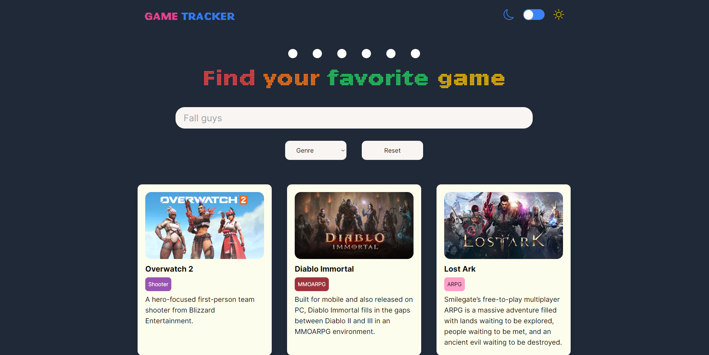

# Game Tracker

## Bem vindo ao meu projeto



## Tech stack

- Next js
- Axios
- Typescript
- Tailwind
- React icons

## Features

- [ x ] Dark mode
- [ x ] custom hook pra fazer a chamada a api
- [ x ] Filtro por genero
- [ x ] Reponsividade
- [ x ] Tela de loading
- [ x ] Tratamento de erros da api
- [ x ] Campo de busca
- [ x ] Layout em colunas

## Como rodar localmente?

### Clone o repositório na sua maquina

```bash
git clone https://github.com/YuriSamp/game-tracker
```

### Guardando as informações no .env

Como a url base da api é sempre a mesma, e é necessário passar um email por header para conseguir fazer a requisição, guarde essas informações no .env, como eu mostro no .env.example

### Instalando as dependencias.

```bash
pnpm install
```

### Rodando a aplicação.

```bash
pnpm dev
```
